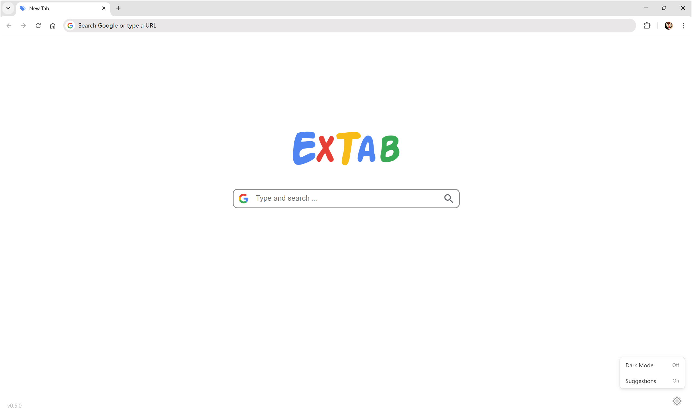

[English](/README.md) | [中文](/README_zh-CN.md)

<h1 align="center">
  
   
  ExTab
   
</h1>

<h3 align="center">
A minimalist browser new tab extension
</h3>

## Introduction

1. Minimal design with low memory usage and fast performance.
2. Replaces the default new tab page and focuses on search.
3. Supports search engine switching, dark mode, and search suggestions.

## Preview

## Usage

1. Download the latest extension archive from [GitHub Releases](https://github.com/yetex1t/extab/releases/latest), then extract it to a fixed folder (do not move it later).
2. Open **Chrome**, go to **Manage Extensions**, and enable **Developer mode**.
3. Click **Load unpacked**, select the extracted extension folder, then open a new tab and choose **Keep it** if prompted.

## License

[MIT](LICENSE)
